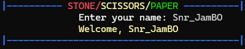
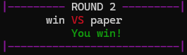
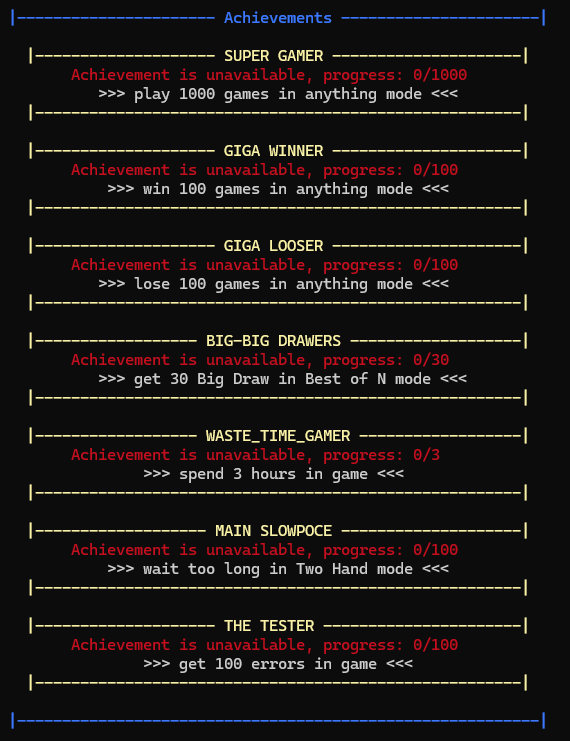
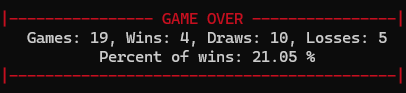

---

## 📄 README.md — содержание (вот так будет выглядеть на GitHub)

```markdown
# 🪨📄✂️ Stone, Paper, Scissors — The Ultimate Console Game

> **Классическая игра с режимами, достижениями, цветами и сохранением прогресса**  
> Написана на Python. Поддерживает нескольких игроков и красивый интерфейс.

---

## 🌈 Особенности
- ✅ **4 игровых режимов**:  
  - Usual — классический режим  
  - Two Hands — как в "Игре в кальмара" (с таймером!)  
  - Until Victory — до N побед  
  - Best of N — победи, пока не поздно  
  - Statistics — твоя статистика  
  - Achievements — заработай достижения

- 🎨 **Цветной интерфейс** с `colorama`
- 🕒 **Таймер в Two Hands** — не успел? Проиграл!
- 💾 **Сохранение статистики** между запусками (в `stats.json`)
- 👥 **Поддержка нескольких игроков** — каждый сохраняет свой прогресс
- 🏆 **Система достижений** — играй ради целей
- 🤖 **Секретные читы**:  
  - `456` — победа  
  - `1202` — ничья  
  - `737` — поражение

---

## 🖼 Скриншоты

### Greetings


### Round 


### Achievements


### Game Over


---

## ⚙️ Как запустить

1. Убедись, что установлен Python 3.8+
2. Установи зависимости:
   ```bash
   pip install colorama
